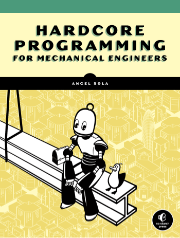

# Mechanics

Learn how to solve mechanics problems using Python 3.
This repository contains the code from the book: **Hardcore Programming for Mechanical Engineers**.

You can buy the book from the [No Starch Press website](https://nostarch.com/), and from [Amazon](https://www.amazon.com/Hardcore-Programming-Engineers-Angel-Sola/dp/171850078).

## Set Up

This project has no external dependencies.
The code is tested (using [GitHub actions](https://github.com/angelsolaorbaiceta/Mechanics/actions)) against Python versions: 3.6, 3.7, 3.8 and 3.9.
It should work fine for any of these.

## Packages

This project includes the following packages:

- [utils](./utils/README.md): utility functions to perform a variety of simple operations
- [geom2d](./geom2d/README.md): two-dimensional geometry primitives and operations
- [eqs](./eqs/README.md): system of equation solvers
- [graphic](./graphic/README.md): graphic-related sub-packages:
    - [svg](./graphic/svg/README.md): SVG images generation based on _geom2d_ primitives
    - [simulation](./graphic/simulation/README.md): Animation generation drawing on a _tkinter_ canvas
- [structures](./structures/README.md): truss structure resolution package

