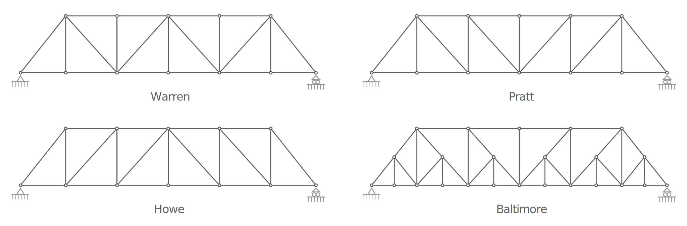

# structures

The _structures_ package defines the modeling and resolution of truss structures.


Once resolved, the solution generation diagram looks like the following:


The _structures_ package is split into sub-packages:


- [_model_](#model)
- [_solution_](#solution)
- [_parse_](#parse)
- [_generation_](#generation)
- [_out_](#out)

## model

The _model_ package defines the model classes that represent a truss structure:

### `Node`

This class represents a node in the structure.
A node is the point where one or more bars meet.

A `Node` can be instantiated using an id an a position:


```python
from geom2d import Point
from structures.model.node import StrNode

node = StrNode(1, Point(10, 35))
```

You can optionally pass a list of loads:

```python
from geom2d import Point, Vector
from structures.model.node import StrNode

loads = [Vector(0, -50), Vector(100, 0)]
node = StrNode(1, Point(10, 35), loads)
```

and add external constraints to the X and Y displacements:

```python
from geom2d import Point, Vector
from structures.model.node import StrNode

node = StrNode(
    _id=1, 
    position=Point(10, 35), 
    loads=[Vector(0, -50), Vector(100, 0)],
    dx_constrained=True,
    dy_constrained=True
)
```

### `Bar`

This class represents a resistant element whose geometry is a straight line segment.

A `Bar` is created with an id, two end nodes, a cross section value and a value for the Young modulus:

```python
from geom2d import Point
from structures.model.node import StrNode
from structures.model.bar import StrBar

node_one = StrNode(1, Point(10, 35))
node_two = StrNode(2, Point(150, 400))
bar = StrBar(
    _id=1, 
    start_node=node_one, 
    end_node=node_two,
    cross_section=25,
    young_mod=20000000
)
```

### `Structure`

A truss `Structure` is a group of linear resistant elements (bars) that joined together are meant to withstand the application of external loads.

A `Structure` is instantiated passing it the sequence of nodes and bars:

```python
nodes = [...]
bars = [...]
structure = Structure(nodes, bars)
```

This class defines a method to solve the structure and obtain the node displacements and reaction forces, as well as the stresses on each of the bars.

```python
solution = structure.solve_structure()
```

## solution

The _solution_ package define the model classes representing the structural elements with their solution values.
This package contains the same elements as _model_ (node, bar and structure), but with their solution values included: `StrNodeSolution`, `StrBarSolution` and `StructureSolution`.

## parse

The _parse_ package defines the functions that can be used to parse the structure model from their text representation.
The structures can be defined in plain text files.
Here's an example of a structure text file:

```
nodes
1: (0.0, 0.0)      (xy)
2: (400.0, 0.0)    (y)
3: (200.0, 400.0)  ()

loads
3 -> (2500.0, -5000.0)

bars
1: (1 -> 2) 30 20000000
2: (2 -> 3) 30 20000000
3: (3 -> 1) 30 20000000
```

The file must contain three sections: `nodes`, `loads` and `bars`.
Each section should be followed by the definition of the entities, each in its own line.

### The Nodes Format

The node definition lines should follow the format:

```
<node_id>: (<x_coord>, <y_coord>) (<external_constraints>)
```

### The Loads Format

The load definition lines should follow the format:

```
<node_id> -> (<Fx>, <Fy>)
```

### The Bars Format

The bar definition lines should follow the format:

```
<bar_id>: (<start_node_id> -> <end_node_id>) <A> <E>
```

### Parsing a Structure From a String

The structure model can be constructed by parsing a string defining the structure:

```python
from structures.parse.str_parse import parse_structure

structure = parse_structure('...')
```

## generation

The _generation_ package defines functions to generate certain typologies of truss structures, such as Warren or Baltimore.



These functions print the structure string representation to the standard output.
They can be imported and used as part of another script:

```python
from geom2d import Vector
from structures.generation.gen_baltimore import generate_baltimore_structure

generate_baltimore_structure(
    spans=6, 
    span=250, 
    height=300, 
    cross_sec=45, 
    young=20000000,
    node_load=Vector(1000, -2000)
)
```

or executed as script:

```bash
python3 structures/generation/gen_baltimore.py 6 250 300 45 20000000 1000 -2000
```

Located in the project's parent folder are bash scripts that wrap the execution of these generation scripts, so following our example above, we could also:

```bash
bash ./gen_baltimore.sh 6 250 300 45 20000000 1000 -2000
```

## out

The _out_ package is in charge of drawing SVG diagrams and writing a text report for the truss structure's resolution.

### Text Report

The structure solution can be writen to a text report for the engineer to analyze the results.
The _text_ module defines a function that produces this text report:

```python
from structures.out.text import structure_solution_to_string

structure_solution = ...
# string report
report = structure_solution_to_string(structure_solution)

# save the string into a file
with open('result.txt', 'w') as file:
    file.write(report)
```

### Diagram

The structure solution can be plotted in a diagram for the engineer to visually inspect.
The _svg_ module defines a function that draws this diagram:

```python
from structures.out.svg import structure_solution_to_svg

structure_solution = ...
settings = {
    # scale applied to the displacements to exaggerate the deformation
    'disp_scale': 100,
    # scale applied to the drawing (bar lengths are converted to px)
    'scale': 1.25,
    # scale applied to draw the load vectors
    'load_scale': 0.75,
    # we want the original geometry also drawn in the diagram
    'no_draw_original': False
}
# SVG string with the diagram
svg = structure_solution_to_svg(structure_solution, settings)

# save the SVG string into a file
with open('result.svg', 'w') as file:
    file.write(svg)
```

The result of this code would be an SVG like the following:


