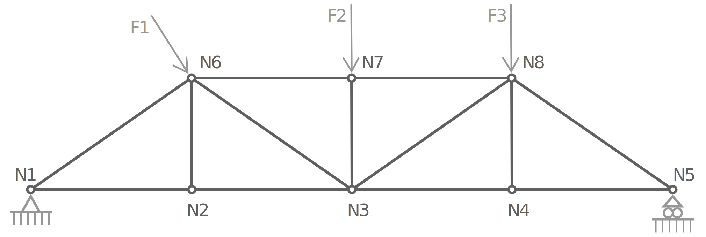

# structures

The _structures_ package defines the modeling and resolution of truss structures.

Once resolved, the solution generation diagram looks like the following:

The _structures_ package is split into sub-packages.
Let's see what each of them does.

## model

TODO

## solution

TODO

## parse

TODO

## generation

TODO

## out

TODO

